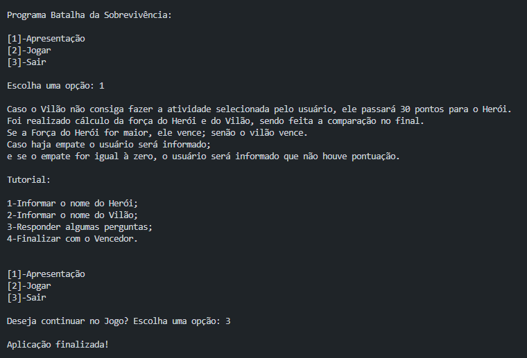

# Batalha da Sobrevivência
## Projeto Back-End com JavaScript
#### Por: iTalents

### Sobre o Projeto

O projeto aborda conceitos de Orientação a Objetos, como Herança, utiliza Estruturas de Decisão e Repetição para controle de fluxo, inclui Tratamento de Exceções para garantir robustez do código, e aplica princípios de Lógica de Programação para resolver problemas de forma eficiente.

##### About the project

The project addresses Object Orientation concepts, such as Inheritance, uses Decision and Repetition Structures for flow control, includes Exception Handling to ensure code robustness, and applies Programming Logic principles to solve problems efficiently.

### Ferramentas de Desenvolvimento
##### (Development Tools)

* Visual Studio Code

### Técnicas Utilizadas
##### (Techniques Used)

* JavaScript;
* Node Js;
* prompt-sync;
* Orientação a Objetos;
* Estrutura de Decisão: IF/Else e Switch;
* Estrutura de Repetição: Do While, While e For;
* Tratamento de Erros: Throw e Try/Catch.

### Instalar Dependências
##### (Install Dependencies)

``
npm install
``
### Executar Programa
##### (Run Program)

``
node index.js
``
### Autor (Author)
#### Katarine Albuquerque
###### Desenvolvedora Front-end (Developer)
   
